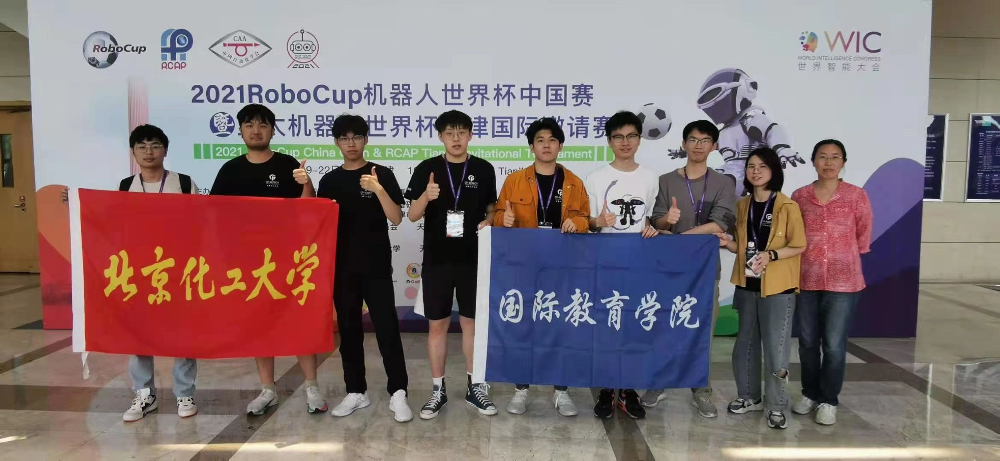
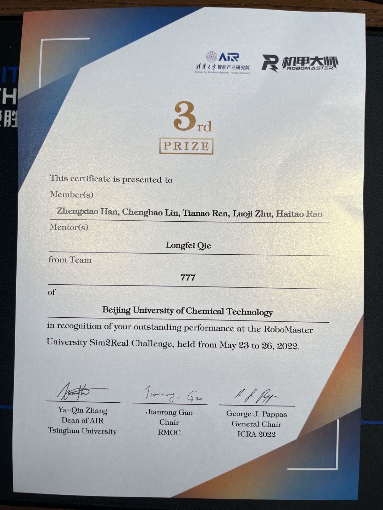
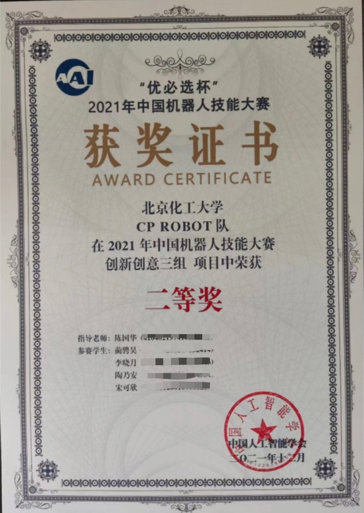
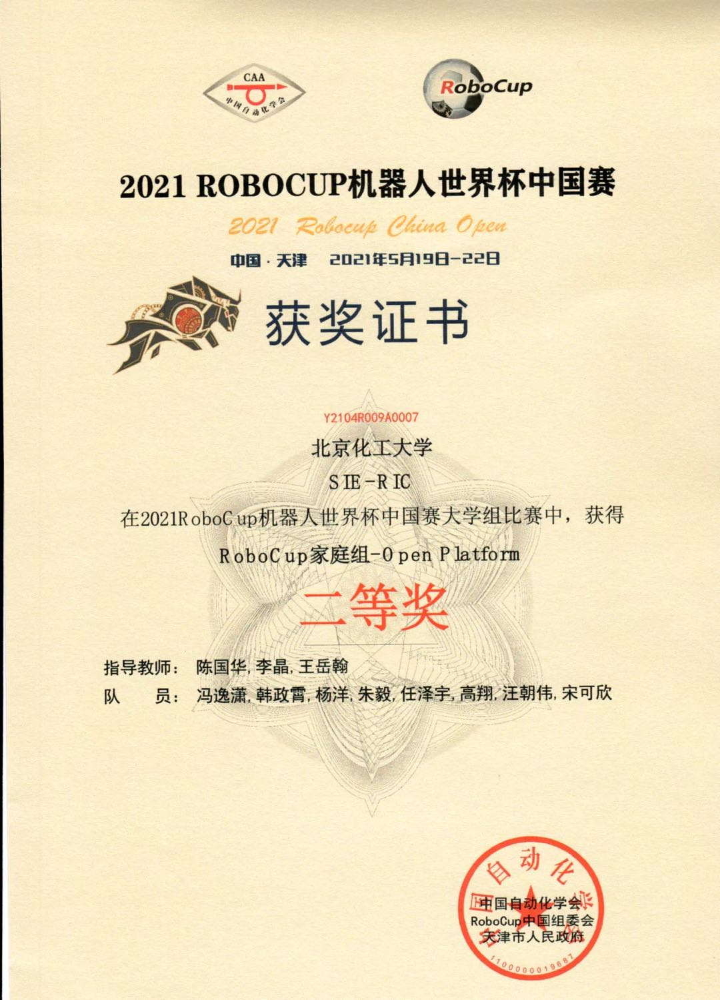
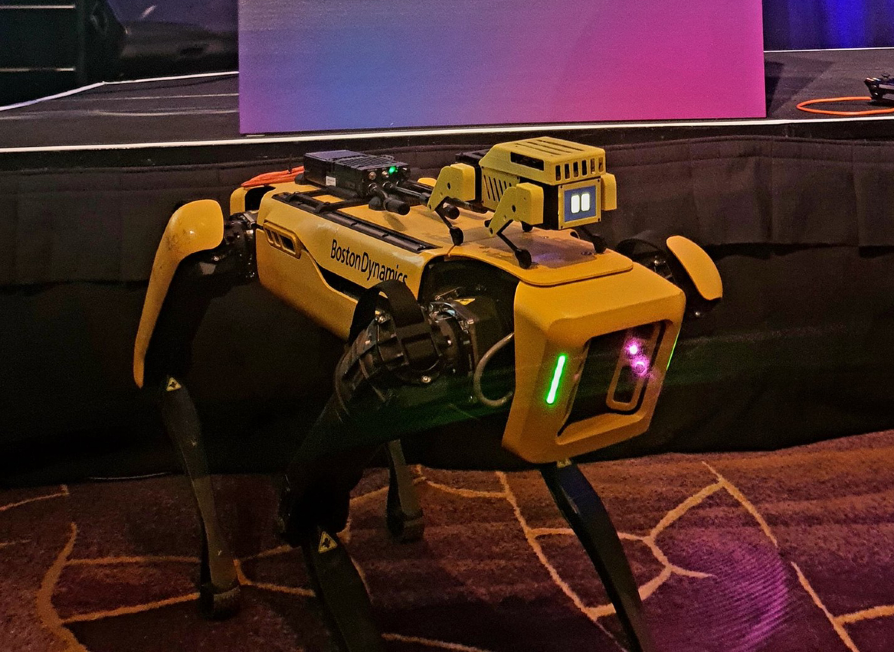

# SIE Robotics 
嗨害！这里是北京化工大学国际教育学院机器人中心！ 
 
## 我们近两年的主要业务有：
* 2021 RoboCup@Home
  
* 2021 中国机器人技能大赛
  
* ICRA 2022 RoboMaster University Sim2Real Challenge
  

## 我们的团队成员做过的项目有：
* [开源12轴机器狗Mini Pupper](https://github.com/mangdangroboticsclub/minipupper_ros)
  
